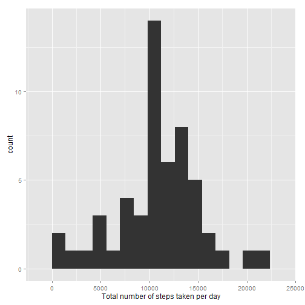
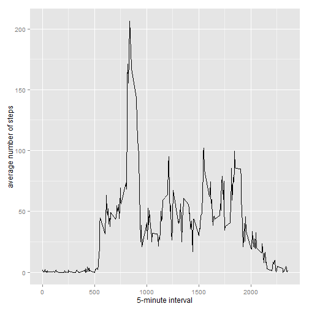
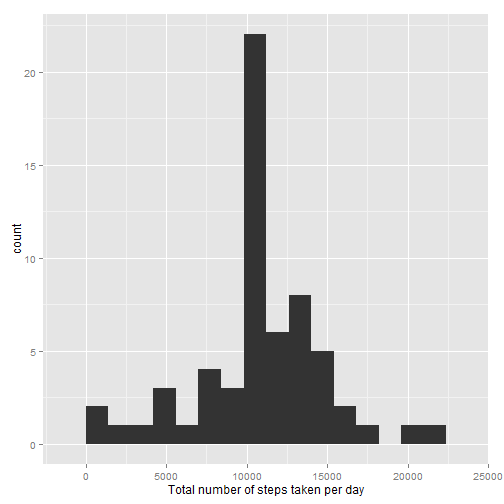
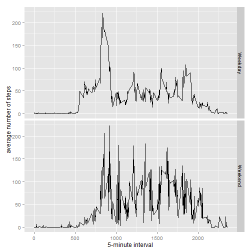

## Introduction

*This document contains the completed work for peer assignment #1 for the Coursera Reproducable Research Course.*

This assignment makes use of data from a personal activity monitoring device. This device collects data at 5 minute intervals through out the day. The data consists of two months of data from an anonymous individual collected during the months of October and November, 2012 and include the number of steps taken in 5 minute intervals each day. 

## Loading and preprocessing the data
The data for the assignment - **'activity.csv'** - is included in this forked repository *RepData_PeerAssessment1* forked from *rdpeng/RepData_PeerAssessment1*.

The variables included in this dataset are:

1. **steps**: Number of steps taking in a 5-minute interval (missing values are coded as NA ) 
2. **date**: The date on which the measurement was taken in YYYY-MM-DD format 
3. **interval**: Identifier for the 5-minute interval in which measurement was taken

**Load the data and transform to numeric and date formates**

```r
if(!file.exists('activity.csv')){
    unzip('activity.zip')
}
activity <- read.csv("activity.csv", colClasses= c("numeric", "Date", "numeric"))
```

## What is mean total number of steps taken per day?
Ignoring 'NA' values the following is conducted:

**1. The total number of steps per day is calculated**

```r
steps.day <- aggregate(steps ~ date, data = activity, FUN = sum)
```

**2. A histogram of the total number of steps per day is plotted**

```r
library(ggplot2)
qplot(steps.day$steps, xlab="Total number of steps taken per day", geom="histogram", binwidth =1400)
```

 

**3. The mean and median total number of steps per day is caluclated and reported**

```r
mean(steps.day$steps, na.rm=TRUE)
```

```
## [1] 10766.19
```

```r
median(steps.day$steps, na.rm=TRUE)
```

```
## [1] 10765
```

## What is the average daily activity pattern?
The following is conducted:

**1. A time series plot (type = "l") with the average number of steps (y-axis)  for each 5-minute interval (x-axis)**

```r
library(ggplot2)
steps.5min <- aggregate(steps~interval, data = activity, 
    FUN = mean, na.rm = TRUE)
ggplot(data = steps.5min, aes(x = interval, y = steps)) + geom_line() + xlab("5-minute interval") + 
    ylab("average number of steps")
```

 

**2. The 5-minute interval with the highest average number of steps**

```r
steps.5min[which.max(steps.5min$steps), c(1,2)]
```

```
##     interval    steps
## 104      835 206.1698
```

## Imputing missing values
Missing values introduce bias in calculations. The follwoing is conducted:

**1. The total number of missing values**

```r
nr_NA <- is.na(activity$steps)
sum(nr_NA)
```

```
## [1] 2304
```
**2. The missing values are estimated by using the mean for the 5-minute interval and then:**
**3. The 'NA' values are replaced by the estimated values**

```r
activity.mis <- activity
activity.mis$steps[nr_NA]<- steps.5min$steps[steps.5min$interval %in% activity.mis$interval[nr_NA]]
```

**4. Replot the histogram with missing values estimated. Caclulate the new mean and median total number of steps taken per day**


```r
steps.day.mis <- aggregate(steps ~ date, data = activity.mis, FUN = sum)
qplot(steps.day.mis$steps, xlab="Total number of steps taken per day", geom="histogram", binwidth=1400)
```

 

```r
mean(steps.day.mis$steps, na.rm=TRUE)
```

```
## [1] 10766.19
```

```r
median(steps.day.mis$steps, na.rm=TRUE)
```

```
## [1] 10766.19
```
The mean totalnumber of steps do not differe but meadian is now the same as the mean. 

## Are there differences in activity patterns between weekdays and weekends?

**1. Creast new factor in dataset with filled-in missing values indicating "weekday" or "weekend"**

```r
activity.mis$day <- weekdays(activity.mis$date)
activity.mis$day[activity.mis$day == c("Saturday","Sunday")] <- "Weekend"
activity.mis$day[activity.mis$day != "Weekend"] <- "Weekday"
```

**2. Creat a panel plot comparing average steps over weekdays and weekends**

```r
steps.5min.day <- aggregate(steps~interval + day, data = activity.mis, 
    FUN = mean)
ggplot(data = steps.5min.day , aes(x = interval, y = steps)) + geom_line() + facet_grid(day~.) + xlab("5-minute interval") + 
    ylab("average number of steps")
```

 
